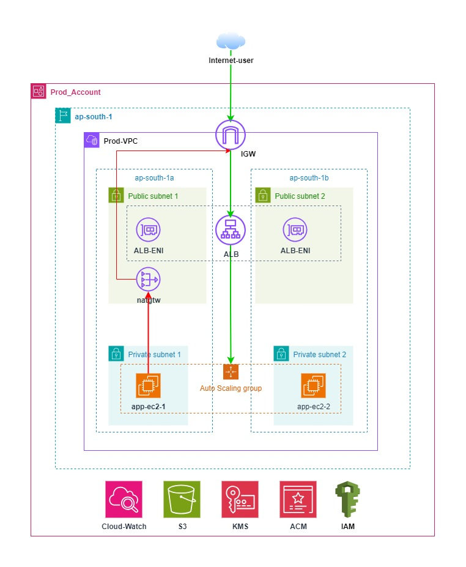

# Application Deployment On AWS Using Terraform

## Description

This project provisions a **production-ready AWS infrastructure** using Terraform. To deploy application on AWS Cloud with automated infra deployment.

## Architecture Digram



## Prerequisite To Deploy Solution

#### Tools

Ensure that **terraform** and **aws** cli is installed with respective permission to create resources. Here are some reference link:
> **[terraform](https://developer.hashicorp.com/terraform/tutorials/aws-get-started/install-cli)** and **[aws](https://docs.aws.amazon.com/cli/latest/userguide/getting-started-install.html)** installation links.

**Note:** Permissions required to run the solution excluded for now and user must follow least-privilages for resource creation.

#### Required Version

| Name | Version |
|------|---------|
| <a name="requirement_terraform"></a> [terraform](#requirement\_terraform) | >= 1.5 |
| <a name="requirement_aws"></a> [aws](#requirement\_aws) | >= 5.0 |

#### S3 bucket creation For Remote Backend

- Ensure to create an s3 bucket to store the state file remotely in the respective region based on requirement.
- Ensure to make the necessary changes within the [backend.tf](./backend.tf) file based on the bucket created in the above step.

##Inputs

- Below are the input required from user to set the vaules according to deployment requirement. It can be implemented using **.tfvar** file before deployment step.

- [userdata.sh] can be change to install required packages according to application requirement

| Name | Description | Type | Default | Required |
|------|-------------|------|---------|:--------:|
| <a name="region"></a> [region](#region) | AWS Region for infra deployment | `string` | `"ap-south-1"` | no |
| <a name="vpc_cidr"></a> [vpc_cidr](#vpc_cidr) | vpc cidr | `string` | `"10.0.0.0/16"` | no |
| <a name="azs"></a> [azs](#azs) | avaulability zones for subnets | `list(string)` | <pre>[<br> "ap-south-1a", "ap-south-1b" <br>]</pre> | no |
| <a name="access_log_bucket_name"></a> [access_log_bucket_name](#access_log_bucket_name) | ALB Access log Bucket Name | `string` | `""` | yes |
| <a name="kms_deletion_window_in_days"></a> [kms_deletion_window_in_days](#kms_deletion_window_in_days) | number of day to keep kms key before deletion | `number` | `7` | no |
| <a name="domain_name"></a> [domain_name](#domain_name) | valid domain name for application | `string` | `""` | yes |
| <a name="app_healthcheck_path"></a> [app_healthcheck_path](#app_healthcheck_path) | Application healthcheck path for ALB health checks | `string` | `"/index.html"` | no |
| <a name="health_check_ineterval"></a> [health_check_ineterval](#health_check_ineterval) | Application healthcheck path for ALB health checks | `string` | `"30"` | no |
| <a name="key_name"></a> [key_name](#key_name) | EC2 Key Pair Name | `string` | `""` | yes |
| <a name="ami_id"></a> [ami_id](#ami_id) | ec2 ami id | `string` | `""` | yes |
| <a name="instance_type"></a> [instance_type](#instance_type) | ec2 instance type | `string` | `"m6a.large"` | no |
| <a name="ebs_volume_size"></a> [ebs_volume_size](#ebs_volume_size) | ebs volume size in GB | `string` | `8` | no |
| <a name="asg_min_size"></a> [asg_min_size](#asg_min_size) | min value of ec2 to be running | `string` | `2` | no |
| <a name="asg_max_size"></a> [asg_max_size](#asg_max_size) | max value of ec2 to be running | `string` | `4` | no |
| <a name="asg_desired_size"></a> [asg_desired_size](#asg_desired_size) | desied value of ec2 to be running | `string` | `2` | no |
| <a name="alert_email"></a> [alert_email](#alert_email) | email for alert notification | `string` | `""` | yes |
| <a name="resource_name"></a> [resource_name](#resource_name) | tag value for resource name | `string` | `"prodapp"` | no |
| <a name="environment"></a> [environment](#environment) | tag value for environment | `string` | `"prod"` | no |
| <a name="cost_center"></a> [cost_center](#cost_center) | tag value for cost_center | `string` | `"webapp"` | no |

## Deployment Steps

1. **Initialize Terraform:**
```bash
terraform init
```
2. **Review the execution plan:**
```bash
terraform plan
```
3. **Excecute the terraform code to create the infrastructure:**
```bash
terraform apply
```

## Architecture Decisions

- **Multi-AZ Deployment**: Resources are deployed across two Availability Zones to ensure high availability and fault tolerance.

- **Private Subnets for EC2**: Application instances are placed in private subnets to prevent direct internet exposure.

- **Application Load Balancer (ALB)**: Used as the entry point to distribute incoming traffic across multiple EC2 instances so application stack are kept private.

- **Auto Scaling Group (ASG)**: Ensures the application remains highly available and automatically adjusts capacity based on demand, aslo dynamic scailing policy applied based on cpu usage.

- **NAT Gateway**: Allows private instances to access the internet securely for updates and package installation without being publicly exposed.

- **Monitoring and Alerting**: Infrastructure components are monitiored and critical alarms are set to prevent application disruption.

- **Terraform Modules**: Infrastructure is split into reusable modules (network, auto-scailing resources including lb, Security, monitoring and alerting) for better maintainability and scalability.

- **Remote State Management**: Terraform state is stored in S3 with user locking to prevent concurrent modifications.

## Cost Estimate and Optimization Recommendations

Get the detailed estimated cost for deploying the solution in below link:

**[AWS Pricing Calculator Link](https://calculator.aws/#/estimate?id=df8cc8333290de148b44238878d55f6397336431)**

**Cosiderations**:
- Currently Ec2 instance size and Compute saving plan is selected with 1 year no upfront commitment considering new application. Can be refactor in future as per recommendations by cost-optimization hub recommendations or as per right sizing required based on metrics data and cost-explorer pattern for atleast 6 month of data.
- AWS Budget and alarm is setup based on estimated cost (approx 150USD) above 80% of actual spend will trigger the alarm.

**Note:** the pricing is given based on mumbai region. calculate cost according to deployment aws region

## Security Measures

- **Private EC2 Instances**: Instances are deployed in private subnets with no public IPs.

- **Security Groups**:
  - ALB allows HTTPS (443) from the internet
  - EC2 allows traffic only from ALB

- **HTTPS Enabled**:
  - ACM certificate used for SSL termination
  - HTTP traffic redirected to HTTPS

- **EBS Encryption**:
  - Volumes are encrypted using a customer-managed KMS key with least privilaged policy

- **IAM Roles**:
  - EC2 instances uses Instance Profile for ssm and cloudwatch only

- **ALB Access Logs**:
  - Stored in S3 for auditing

- **No SSH Access**:
  - AWS SSM is used for secure instance access

## Scaling Strategy

- **Auto Scaling Group (ASG)**:
  - Minimum: 2 instances
  - Maximum: 4 instances
  - Desired: 2 instances

**Note:** The values above can be modified as per the requirement and workload.

- **Multi-AZ Deployment**:
  - Instances are distributed across multiple Availability Zones for resilience

- **Dynamic Scaling**:
  - CloudWatch alarms monitor CPU utilization
  - Scale-out triggered when CPU usage is high
  - Scale-in when usage is low

- **Load Balancing**:
  - ALB distributes incoming traffic evenly across instances

## Future Enhansment

- AWS RDS database with multi-AZ can be setup which is currenlty out-of scope for requirement.
- AWS WAF can be setup for web application security.

This solution ensures the production system can handle varying traffic loads while maintaining high availability. Also flexible to deploy different application according to infra requirements because of reusability of terraform structure.

